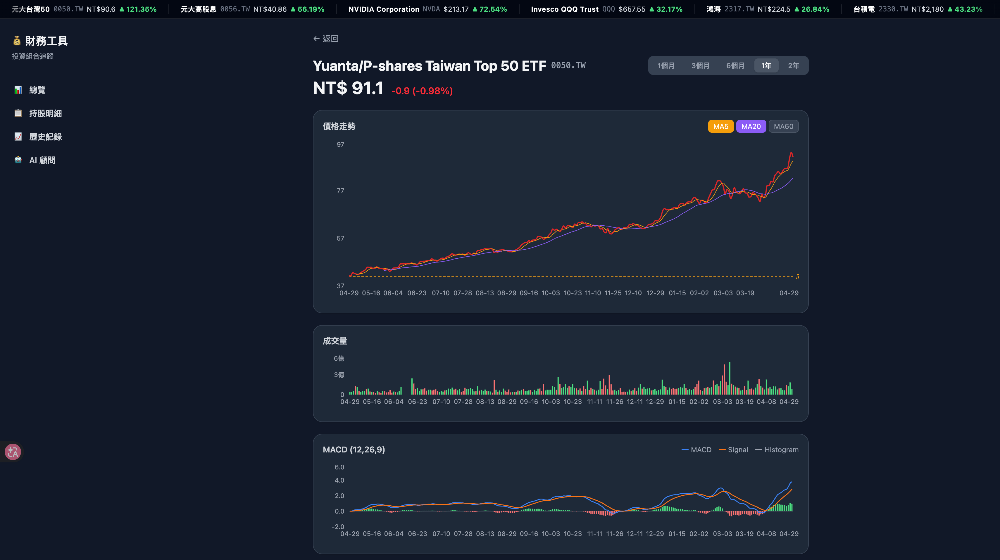

# 💰 財務工具 — 投資組合追蹤

本地端投資組合追蹤工具，自動抓取台股、美股、ETF、加密貨幣的即時價格，計算市值與損益，並提供 AI 分析建議。



---

## ✨ 功能

| 功能 | 說明 |
|---|---|
| **多資產類別** | 台股、美股、台灣/美國 ETF、台灣共同基金、加密貨幣、大宗商品（黃金等） |
| **即時價格** | 透過 yfinance 抓取，一鍵更新，自動換算 TWD |
| **資產配置** | 可視化持倉比例（條狀圖 + 明細列表），同 symbol 自動合併 |
| **損益熱力圖** | Treemap 色塊大小 = 市值，顏色深淺 = 漲跌幅 |
| **歷史趨勢** | 市值 vs 成本折線圖，支援 30天 / 90天 / 180天 / 1年 |
| **歷史回填** | 用 yfinance 歷史資料回填過去一年的每日快照 |
| **技術指標** | 個股頁：K 線走勢、MA5/20/60、MACD、KD、成交量 |
| **AI 分析** | 按需呼叫 Gemini，自動產生整體表現 / 配置評估 / 風險 / 建議 |
| **分析歷史** | 每次 AI 分析依時間存檔，可點選回顧歷史紀錄 |
| **AI 顧問聊天** | 對話式 AI 顧問，結合持倉資料回答投資問題 |
| **持股新聞** | Dashboard 自動聚合前十大持股相關新聞，30 分鐘快取 |
| **券商分類** | 透過備注欄標記券商，HoldingsPage 支援 Tab 切換過濾 |
| **CSV 匯出** | 一鍵下載持股明細（含現價、市值、損益） |
| **深色模式** | 跟隨系統偏好，側邊欄可手動切換 |
| **跑馬燈** | 頂部顯示所有持股即時價格與漲跌 |

---

## 🛠 Tech Stack

| 層 | 技術 |
|---|---|
| **Backend** | Python 3.11+ · FastAPI · SQLModel · SQLite |
| **價格來源** | yfinance（台股 `.TW`、美股、ETF、加密貨幣、大宗商品） |
| **台灣共同基金** | fundclear.com.tw 爬蟲備援 |
| **排程** | APScheduler（每日 18:00 / 22:00 自動快照） |
| **AI** | Google Gemini 2.5 Flash（google-genai SDK） |
| **Frontend** | React 19 · TypeScript · Vite · Tailwind CSS v4 |
| **圖表** | Recharts · 純 SVG Treemap |

---

## 🚀 快速開始

### 前置需求

- Python 3.11+
- Node.js 20+
- Gemini API Key（[免費申請](https://aistudio.google.com/app/apikey)，AI 功能才需要）

### 安裝與啟動

```bash
git clone https://github.com/your-username/portfolio-tracker.git
cd portfolio-tracker

# 設定環境變數
cp backend/.env.example backend/.env
# 編輯 backend/.env，填入 GEMINI_API_KEY=...

# 一鍵啟動（首次會自動建立 venv 並安裝套件）
bash start.sh
```

啟動後：

- **前端**：http://localhost:3000
- **API 文件**：http://localhost:8000/docs

### 環境變數

在 `backend/.env` 設定：

```env
GEMINI_API_KEY=your_gemini_api_key_here
```

不設定 API Key 時，AI 相關功能（分析、顧問聊天）會回傳 503 錯誤，其餘功能正常運作。

---

## 📁 專案結構

```
.
├── start.sh                        # 一鍵啟動腳本
├── backend/
│   ├── main.py                     # FastAPI app
│   ├── models.py                   # SQLModel 資料表定義
│   ├── schemas.py                  # Pydantic schemas
│   ├── database.py                 # SQLite 連線
│   ├── requirements.txt
│   ├── routers/
│   │   ├── holdings.py             # 持股 CRUD
│   │   ├── prices.py               # 價格更新
│   │   ├── portfolio.py            # 總覽 / 配置 / 歷史 / 新聞
│   │   ├── stocks.py               # 個股詳情（含技術指標）
│   │   └── chat.py                 # AI 顧問 & 分析
│   ├── services/
│   │   ├── price_fetcher.py        # yfinance wrapper
│   │   └── scheduler.py            # APScheduler 排程
│   └── data/
│       └── portfolio.db            # SQLite 資料庫（gitignored）
└── frontend/
    ├── src/
    │   ├── pages/
    │   │   ├── DashboardPage.tsx   # 總覽（AI分析、摘要、圖表、新聞）
    │   │   ├── HoldingsPage.tsx    # 持股明細
    │   │   ├── StockDetailPage.tsx # 個股分析（K線、MA、MACD、KD）
    │   │   ├── HistoryPage.tsx     # 歷史記錄
    │   │   └── ChatPage.tsx        # AI 顧問對話
    │   ├── components/
    │   │   ├── Charts/             # AllocationPie · ValueTrendLine · PnlHeatmap
    │   │   ├── Holdings/           # HoldingTable · HoldingForm
    │   │   ├── Summary/            # SummaryCards
    │   │   └── Layout/             # Layout · Ticker
    │   ├── context/
    │   │   └── ThemeContext.tsx    # 深色模式管理
    │   ├── store/
    │   │   └── usePortfolioStore.ts # Zustand 全域狀態
    │   └── api/
    │       └── client.ts           # Axios API 客戶端
    └── vite.config.ts              # /api → localhost:8000 proxy
```

---

## 📊 支援的資產類別

| 類型 | 範例 Symbol | 計價幣別 |
|---|---|---|
| 台灣股票 | `2330.TW`、`2317.TW` | TWD |
| 美國股票 | `AAPL`、`NVDA`、`TSLA` | USD |
| 台灣 ETF | `0050.TW`、`00878.TW` | TWD |
| 美國 ETF | `VOO`、`QQQ`、`SPY` | USD |
| 台灣共同基金 | `0P0000XXXX.TW` | TWD |
| 加密貨幣 | `BTC-USD`、`ETH-USD` | USD |
| 大宗商品 | `GC=F`（黃金）、`SI=F`（白銀）、`CL=F`（原油） | TWD |

---

## 🤖 AI 功能說明

### 投資組合分析
Dashboard 頂部「✨ 開始分析」按鈕，Gemini 會讀取當前所有持倉資料，產出：
- 整體表現摘要
- 資產配置評估（地區 / 類別 / 個股集中度）
- 主要風險點
- 具體改善建議

每次分析結果依時間戳儲存，可隨時點選回顧歷史紀錄。

### AI 顧問聊天
「AI 顧問」頁面支援多輪對話，每次請求都會帶入最新持倉資料作為上下文。

> ⚠️ AI 輸出僅供參考，不構成正式投資建議。

---

## 📝 使用說明

1. **新增持股**：點擊「持股明細 → + 新增持股」，輸入 Symbol 後系統自動查詢名稱
2. **更新價格**：點擊「🔄 更新價格」手動觸發，或等每日排程自動執行
3. **回填歷史**：首次使用點擊「回填歷史」，載入過去一年每日市值資料
4. **台灣共同基金**：若自動抓取失敗，可在持股明細點「輸入淨值」手動填入當日 NAV
5. **券商分類**：在備注欄填入券商名稱（例：永豐金、富途），即可在持股明細切換篩選
6. **AI 分析**：按需呼叫，結果自動存檔，不佔 API 配額直到按下按鈕

---

## 🔒 隱私說明

所有資料儲存在本機 `backend/data/portfolio.db`（SQLite），不上傳任何持倉資料到外部服務，除非主動點擊 AI 分析功能（此時持倉摘要會送至 Google Gemini API）。

---

## License

MIT
